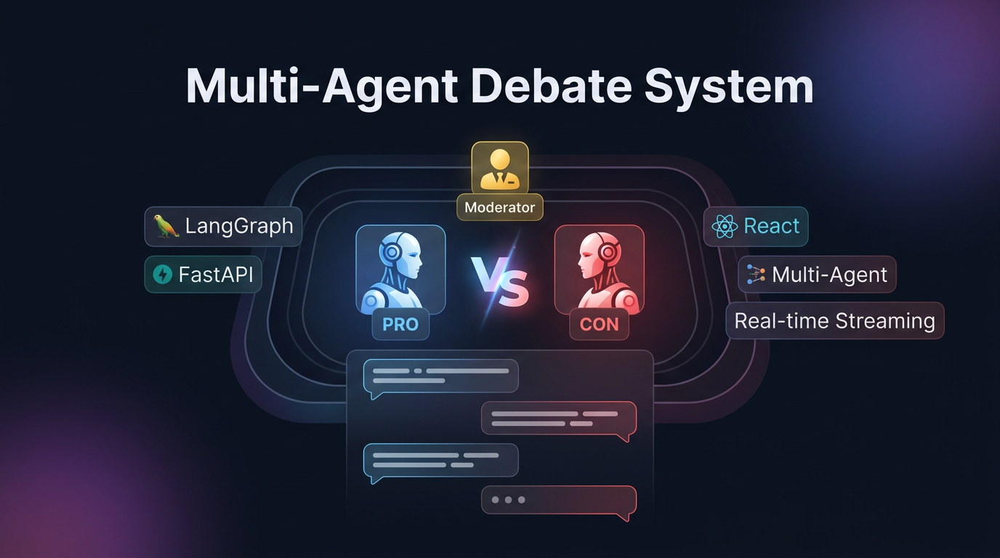
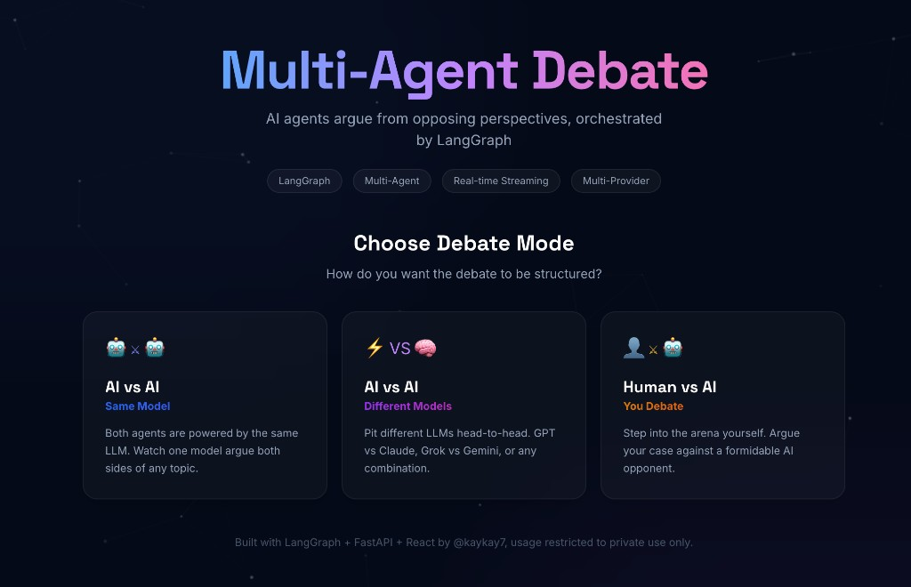
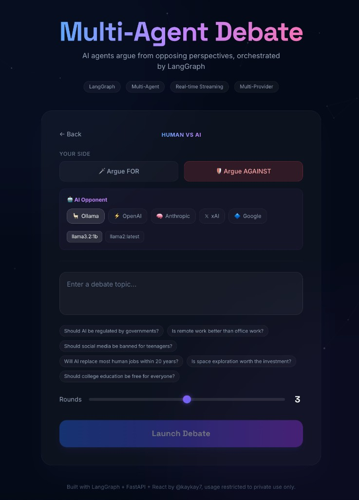

# Multi-Agent Debate System

> **Proprietary Software** — Copyright (c) 2026 Kunal Kamdar. All Rights Reserved.
> This project is **not** open source. See [LICENSE](./LICENSE) and [NOTICE](./NOTICE) for details.

A real-time AI debate platform where multiple LLM-powered agents argue opposing perspectives on any topic, orchestrated by **LangGraph** with a live-streaming UI.

<p align="center">
  
</p>

### Screenshots

<p align="center">
  
  &nbsp;&nbsp;
  
</p>

## Highlights

- **Multi-Agent Architecture** — Three specialized agents (Advocate, Skeptic, Moderator) with distinct personalities and debate strategies
- **LangGraph Orchestration** — State-machine-driven debate flow with conditional routing, round management, and structured turn-taking
- **Real-time Token Streaming** — Every word streams live over WebSocket as agents "speak"
- **Cinematic UI** — Animated avatars, particle backgrounds, glassmorphism cards, and sound-bar visualizations

## Architecture

```
┌─────────────────────────────────────────────────────────────┐
│                     FRONTEND (React)                         │
│  ┌──────────┐  ┌──────────────┐  ┌────────────────────────┐│
│  │  Topic    │  │  Agent       │  │  Debate Arena          ││
│  │  Input    │  │  Avatars     │  │  (live message stream) ││
│  └──────────┘  └──────────────┘  └────────────────────────┘│
│                    ▲ WebSocket (token stream)                │
└────────────────────┼────────────────────────────────────────┘
                     │
┌────────────────────┼────────────────────────────────────────┐
│                BACKEND (FastAPI)                             │
│                    │                                         │
│  ┌─────────────────▼──────────────────────────────────────┐ │
│  │              LangGraph State Machine                    │ │
│  │                                                         │ │
│  │  ┌───────────┐    ┌──────────┐    ┌──────────┐        │ │
│  │  │ Moderator │───►│   Pro    │───►│   Con    │──┐     │ │
│  │  │  Intro    │    │ Argument │    │ Argument │  │     │ │
│  │  └───────────┘    └──────────┘    └──────────┘  │     │ │
│  │                        ▲                         │     │ │
│  │                        │    ┌──────────────┐    │     │ │
│  │                        └────│  Increment   │◄───┘     │ │
│  │                  (continue) │    Round     │           │ │
│  │                             └──────┬───────┘           │ │
│  │                                    │ (done)            │ │
│  │                             ┌──────▼───────┐           │ │
│  │                             │  Moderator   │           │ │
│  │                             │   Summary    │──► END    │ │
│  │                             └──────────────┘           │ │
│  └─────────────────────────────────────────────────────────┘ │
│                           │                                   │
│                    ┌──────▼──────┐                            │
│                    │  OpenAI API │                            │
│                    │  (GPT-4o)   │                            │
│                    └─────────────┘                            │
└──────────────────────────────────────────────────────────────┘
```

## Tech Stack

| Layer | Technology |
|-------|-----------|
| Multi-Agent Orchestration | LangGraph (StateGraph with conditional edges) |
| LLM Provider | **Ollama** (local), **OpenAI**, **Google Gemini**, **Anthropic**, **xAI/Grok** — switchable in the UI |
| Backend | FastAPI + WebSocket |
| Frontend | React 18 + Framer Motion + Tailwind CSS |
| Streaming | Token-level WebSocket streaming |

## Quick Start

### Prerequisites

- Python 3.11+
- Node.js 18+
- **Ollama** installed locally ([ollama.com](https://ollama.com)) — *or* an OpenAI API key

### 1. Clone & configure

```bash
git clone https://github.com/YOUR_USERNAME/multi-agent-debate-system.git
cd multi-agent-debate-system

cp backend/.env.example backend/.env
# Edit backend/.env — defaults to Ollama (no API key needed)
```

> **Using Ollama (default)?** Make sure Ollama is running (`ollama serve`) and you have a model pulled:
> ```bash
> ollama pull llama3.2
> ```
>
> **Prefer OpenAI?** Set `LLM_PROVIDER=openai` and add your `OPENAI_API_KEY` in `backend/.env`.

### 2. Start the backend

```bash
cd backend
python -m venv venv
source venv/bin/activate   # Windows: venv\Scripts\activate
pip install -r requirements.txt
uvicorn main:app --reload --port 8000
```

### 3. Start the frontend

```bash
cd frontend
npm install
npm run dev
```

Open **http://localhost:5173** and start a debate!

## Live Demo

> **[Try it live](https://multi-agent-debate-system-fwyr.onrender.com)** — hosted on Render with Google Gemini
>
> The free tier sleeps after 15 minutes of inactivity, so the first load may take ~30 seconds to wake up.

## How It Works

1. **User enters a topic** — e.g., "Should AI be regulated by governments?"
2. **Moderator introduces** — Sets the stage with context and stakes
3. **The Advocate argues FOR** — Passionate, evidence-based arguments
4. **The Skeptic argues AGAINST** — Critical analysis, counter-evidence
5. **Rounds repeat** — Each round, agents respond to each other's latest points
6. **Moderator synthesizes** — Balanced summary highlighting key tensions and common ground

Every token streams in real time — you watch the debate unfold word by word.

## Project Structure

```
multi-agent-debate-system/
├── backend/
│   ├── main.py                 # FastAPI server + WebSocket endpoint
│   ├── debate/
│   │   ├── graph.py            # LangGraph state machine + streaming nodes
│   │   ├── prompts.py          # Agent system prompts / personalities
│   │   └── guardrails.py       # Age-based content filtering + suggestions
│   ├── requirements.txt
│   └── .env.example
├── frontend/
│   ├── src/
│   │   ├── App.jsx             # Main app with state routing
│   │   ├── components/
│   │   │   ├── DebateArena.jsx # Live debate view + message bubbles
│   │   │   ├── AgeGate.jsx     # Age-tier selection screen
│   │   │   ├── DebateSetup.jsx # Topic + mode configuration
│   │   │   ├── ModeSelector.jsx# Debate mode picker (AI v AI, AI v Human…)
│   │   │   ├── AgentAvatar.jsx # Animated avatar with speaking indicators
│   │   │   └── ParticleBackground.jsx  # Canvas particle system
│   │   └── hooks/
│   │       └── useDebateWebSocket.js   # WebSocket state management
│   └── public/avatars/         # AI-generated agent portraits
├── build.sh                    # Cloud build script (frontend + backend)
├── render.yaml                 # Render one-click deploy blueprint
├── LICENSE                     # Proprietary license
├── NOTICE                      # IP notice
└── README.md
```

## Configuration

| Environment Variable | Default | Description |
|---------------------|---------|-------------|
| `LLM_PROVIDER` | `ollama` | `ollama`, `openai`, `google`, `anthropic`, or `xai` |
| `OLLAMA_BASE_URL` | `http://localhost:11434` | Ollama server address |
| `OLLAMA_MODEL` | `llama3.2` | Default Ollama model |
| `OPENAI_API_KEY` | — | Your OpenAI API key |
| `OPENAI_MODEL` | `gpt-4o-mini` | Default OpenAI model |
| `GOOGLE_API_KEY` | — | Google Gemini API key ([free tier](https://aistudio.google.com/apikey)) |
| `ANTHROPIC_API_KEY` | — | Anthropic API key |
| `XAI_API_KEY` | — | xAI/Grok API key |

## License

This project is **proprietary software**. It is not licensed under any open-source license.

You may view the source code for evaluation and portfolio review purposes only. You may **not** copy, modify, distribute, or use this code (or any derivative of it) in any product, service, or project — commercial or otherwise — without explicit written permission from the author.

See [LICENSE](./LICENSE) for the full legal terms.

Copyright (c) 2026 Kunal Kamdar. All Rights Reserved.
